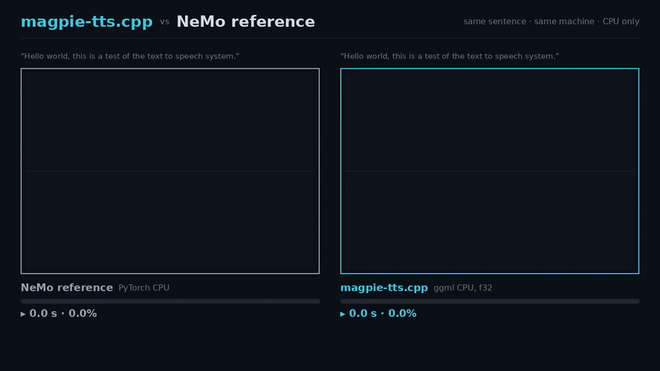

# magpie-tts.cpp

**Brought to you by the [LocalAI](https://github.com/mudler/LocalAI) team**, the folks behind LocalAI, the open-source AI engine that runs any model (LLMs, vision, voice, image, video) on any hardware, no GPU required.

[](https://huggingface.co/mudler/magpie-tts.cpp-gguf)
[](LICENSE)
[](https://github.com/mudler/LocalAI)

A from-scratch C++17/[ggml](https://github.com/ggml-org/ggml) port of NVIDIA's [Magpie TTS Multilingual 357M](https://huggingface.co/nvidia/magpie_tts_multilingual_357m) text-to-speech model, including its [NanoCodec](https://huggingface.co/nvidia/nemo-nano-codec-22khz-1.89kbps-21.5fps) neural audio codec. One self-contained GGUF file (model, codec, tokenizer, G2P dictionaries), no Python, PyTorch, NeMo, or CUDA toolkit at inference. Numerically parity-gated against NeMo per component, and orders of magnitude faster than the NeMo reference pipeline on CPU.



> The same sentence, side by side: equivalent speech, magpie-tts.cpp gets there first ([full clip](benchmarks/media/magpie_race.mp4)).

You get 22.05 kHz mono speech in 5 voices (Aria, Jason, John, Leo, Sofia) across 9 languages today (en, es, de, fr, it, pt-BR, hi, vi, ko, plus 3 Arabic variants), from a CLI, a C++ library, or a flat C API loadable via dlopen/FFI from Go, Rust, or anything else.

## What it does

- **Text to speech**: encoder + autoregressive decoder over NanoCodec tokens, with classifier-free guidance, inference-time attention prior, local transformer codebook refinement, and the NanoCodec decoder to PCM, all in ggml graphs.
- **Tokenization in C++**: the full NeMo aggregated tokenizer replicated, IPA G2P with the dictionaries embedded in the GGUF (en, es, de, pt-BR, hi), byte-level for fr/it/vi/ko, Arabic character sets. Mandarin and Japanese are not supported yet (they need jieba/pyopenjtalk segmentation).
- **Deterministic sampling**: seeded top-k/temperature sampling; same seed, same audio.

## Supported models

| Model | Task | Size (f32 / q8_0 / q4_k) | Parity | Source |
|---|---|---|---|---|
| magpie_tts_multilingual_357m | TTS, 9+ languages, 5 voices | 1294 / 624 / 541 MB | teacher-forced logit replay max abs diff 3.6e-5 vs NeMo; ASR round-trip exact on all quants | [nvidia/magpie_tts_multilingual_357m](https://huggingface.co/nvidia/magpie_tts_multilingual_357m) |

The GGUF also embeds the NanoCodec decoder (bit-exact FSQ, waveform max abs diff 3.3e-6 vs NeMo).

## Performance

Measured on a Ryzen 9 9950X3D, CPU only. The NeMo reference pipeline (as shipped, no decoder KV cache) needs about 17 s per decoder step on the same machine; magpie-tts.cpp runs the same step KV-cached in tens of milliseconds.

| Engine | Load | AR decode | Codec | Total | Audio | Time per audio second |
|---|---|---|---|---|---|---|
| NeMo reference (PyTorch CPU, f32) | 101.9 s | ~17 s/step | (incl.) | 805.7 s | 4.23 s | 190.5 s |
| magpie-tts.cpp f32 | 0.32 s | 103 ms/step | 6.8 s | 12.1 s | 3.99 s | 3.0 s (63x faster) |
| magpie-tts.cpp q8_0 | 0.16 s | 65 ms/step | 6.8 s | 9.5 s | 3.67 s | 2.6 s (73x faster) |

Medians over 3 runs of `magpie-cli bench`, same sentence, seed 1234.

Honest notes: the largest single factor is that the NeMo reference recomputes the whole sequence every decoder step while this port uses a KV cache (an approximation NeMo ships support for but leaves off in this checkpoint's config -- measured `use_kv_cache_for_inference = False` on both CPU and GPU); the remaining gap comes from ggml graphs, f32 im2col paths, and no framework overhead. Quantized variants decode roughly 1.6 to 1.8 times faster than f32. See [benchmarks/BENCHMARK.md](benchmarks/BENCHMARK.md) for methodology and full numbers.

### See it run

```bash
./build/examples/cli/magpie-cli say \
  --model models/magpie-tts-multilingual-357m-q8_0.gguf \
  --text "Hello world, this is a test of the text to speech system." \
  --lang en --speaker Aria --seed 1234 --output hello.wav
```

## Build

```bash
git clone --recursive https://github.com/mudler/magpie-tts.cpp
cd magpie-tts.cpp
cmake -B build -DCMAKE_BUILD_TYPE=Release
cmake --build build -j
```

### CMake options

| Option | Default | Meaning |
|---|---|---|
| `MAGPIE_BUILD_CLI` | ON | build `magpie-cli` |
| `MAGPIE_BUILD_TESTS` | ON | build parity tests |
| `MAGPIE_SHARED` | OFF | build `libmagpie-tts.so` (for LocalAI / FFI) |
| `MAGPIE_GGML_CUDA` / `METAL` / `VULKAN` / `HIP` | OFF | ggml GPU backends |

### GPU

Build with `-DMAGPIE_GGML_CUDA=ON` and select the device at runtime with the
`MAGPIE_DEVICE` environment variable: unset or `cpu` keeps the CPU path
(default, byte-identical to a CPU-only build), `cuda`/`gpu`/`auto` picks the
first GPU in the ggml registry, or pass an explicit registry name like
`CUDA0`. Weights, KV cache and every graph then live on the device; ops the
backend does not support fall back to CPU per graph (logged, none on CUDA).
GPU numbers in [benchmarks/BENCHMARK.md](benchmarks/BENCHMARK.md#gpu-nvidia-gb10-dgx-spark).

```bash
MAGPIE_DEVICE=cuda ./build/examples/cli/magpie-cli say --model ... --text "..."
```

## Get the model

Prebuilt GGUFs: [huggingface.co/mudler/magpie-tts.cpp-gguf](https://huggingface.co/mudler/magpie-tts.cpp-gguf) (f32, f16, q8_0, q6_k, q5_k, q4_k).

To convert from the original checkpoints yourself, see [docs/conversion.md](docs/conversion.md).

## Quantization

Selective, allowlist-driven: only weights consumed by `ggml_mul_mat` are quantized; everything the engine reads as raw floats (norms, position embeddings, baked speaker context, codec convolutions, codebook embeddings) stays f32. All six variants pass an ASR round-trip check (a parakeet.cpp transcription of the generated audio matches the input text exactly). Details and drift numbers in [docs/quantization.md](docs/quantization.md).

```bash
.venv/bin/python scripts/quantize_gguf.py \
  models/magpie-tts-multilingual-357m-f32.gguf q8_0
```

## CLI

```bash
magpie-cli info  --model <model.gguf>
magpie-cli say   --model <model.gguf> --text "..." [--lang en] [--speaker Aria|0] [--seed N] [--output out.wav] [--threads N]
magpie-cli bench --model <model.gguf> [--runs 3] [--json]
```

Speakers: Aria, Jason, John, Leo, Sofia (or indices 0 to 4). Languages: `en`, `es`, `de`, `fr`, `it`, `pt-BR`, `hi`, `vi`, `ko`, `ar-AE`, `ar-SA`, `ar-MSA`.

## Library / C API

C++: `include/magpie_tts.h` (`magpie_tts_load`, `magpie_tts_synthesize`, options for language, speaker, temperature, top-k, CFG scale, seed).

C ABI for dlopen/purego/FFI: `include/magpie_tts_capi.h`

```c
magpie_tts_ctx *ctx = magpie_tts_capi_load("model.gguf");
int n = 0;
float *pcm = magpie_tts_capi_synthesize(ctx, "Hello!", "en", 0, &n);
/* 22050 Hz mono f32; on error: NULL, see magpie_tts_capi_last_error(ctx) */
magpie_tts_capi_free_audio(pcm);
magpie_tts_capi_free(ctx);
```

Exceptions never cross the boundary; `magpie_tts_capi_abi_version()` gates compatibility.

## Use it from LocalAI

A LocalAI backend is planned; the shared-library build (`-DMAGPIE_SHARED=ON`, ggml statically linked) is the artifact LocalAI loads via purego. Watch the [LocalAI repo](https://github.com/mudler/LocalAI) for the gallery entry.

## Verification / Parity

Every component is gated numerically against tensors dumped from the reference NeMo implementation (see [docs/architecture-magpietts.md](docs/architecture-magpietts.md) and `tests/`):

| Gate | Result |
|---|---|
| Tokenizer (9 languages) | exact ids; 540/540 randomized sentences match NeMo |
| Text encoder | max abs diff 2.9e-6 |
| Decoder step (CFG, cross-attn, prior) | logits 1.2e-5; priors and attended positions bitwise |
| Local transformer (16 heads) | rel err about 3e-6 |
| NanoCodec FSQ | bit-exact |
| NanoCodec decoder | waveform max abs diff 3.3e-6 |
| Full 42-step decode loop (teacher-forced replay) | logits max abs diff 3.6e-5 |

Run them yourself: `MAGPIE_MODEL=<f32.gguf> MAGPIE_REF_DUMP=<dump.gguf> ctest --test-dir build`.

## Why magpie-tts.cpp

- One file, no runtime dependencies: model + codec + tokenizer + G2P dictionaries in a single GGUF.
- Proven numerics, not vibes: per-component parity gates against the reference, honest quantization notes.
- Small and portable: 541 MB at q4_k, CPU-first, any ggml backend.
- Embeddable: static or shared library, flat C ABI, deterministic output.

Credit where due: the model and codec are by NVIDIA (NeMo team), released under the [NVIDIA Open Model License](https://huggingface.co/nvidia/magpie_tts_multilingual_357m). This repo is an independent inference implementation; the GGUF weights keep NVIDIA's license.

## Citation

```bibtex
@software{magpie_tts_cpp,
  title  = {magpie-tts.cpp: a C++/ggml inference engine for Magpie TTS},
  author = {Di Giacinto, Ettore},
  url    = {https://github.com/mudler/magpie-tts.cpp},
  year   = {2026}
}
```

## Author

Ettore Di Giacinto ([@mudler](https://github.com/mudler))

## License

MIT (see [LICENSE](LICENSE)). Model weights: NVIDIA Open Model License.

---

Built by the [LocalAI](https://github.com/mudler/LocalAI) team. If you want to run text to speech (and LLMs, vision, voice, image, and video models) locally on any hardware with an OpenAI-compatible API, [give LocalAI a star](https://github.com/mudler/LocalAI).
